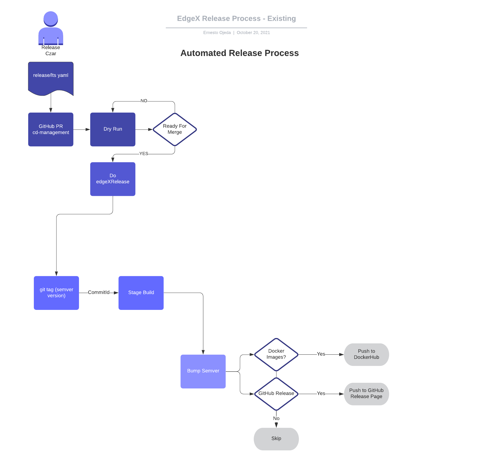
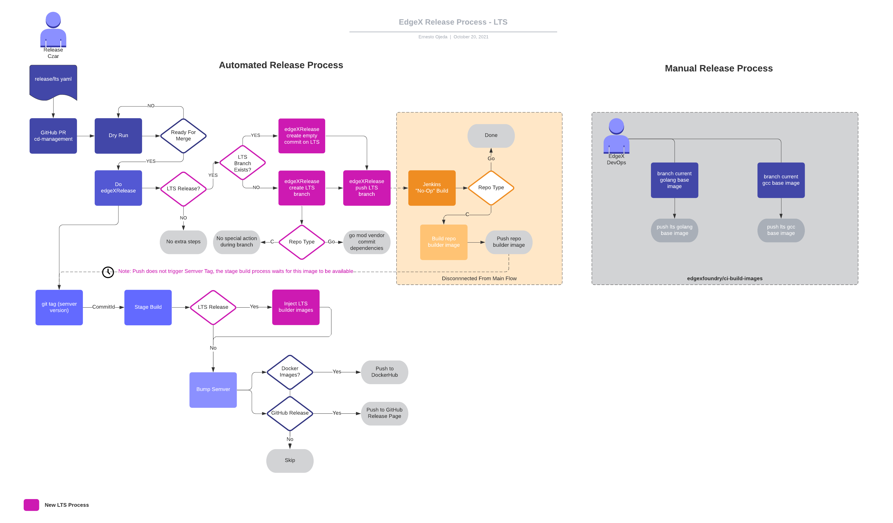

# Jakarta Release Stages

## Release Architecture

### Pre-LTS Flow



### Post-LTS Flow



## C Based Services

### Release Flow

- 🆕 edgeXRelease: creates and pushes "jakarta" branch at specific git sha
  - The push of the tag triggers new LTSRelease build
  - Job: <https://jenkins.edgexfoundry.org/blue/organizations/jenkins/edgexfoundry%2Fdevice-coap-c/detail/lts-test/19/pipeline/81>
  - "LTS Release Build", builds project specific relevant ci build images (x86_64, arm64) will all dependencies bundled
  - Images are pushed to nexus release, i.e. nexus3.edgexfoundry.org:10002/device-coap-c-builder-{ARCH}:{GIT SHA}
- **[Existing]** edgeXRelease: tags git sha with release version e.g. 2.1.0
- **[Existing]** edgeXRelease: stages build artifact, i.e. triggers device-coap-c/jakarta job
  - 🆕 If this is a C build and LTS we will need to wait until the first LTSRelease build is done before running this build. New function `edgex.waitForImages` is used to wait until builder images are ready.
  - Job: <https://jenkins.edgexfoundry.org/blue/organizations/jenkins/edgexfoundry%2Fdevice-coap-c/detail/lts-test/20/pipeline/154>
- **[Existing]** edgeXRelease: Bump Semver, i.e. next dev tag 2.1.1-dev.1

### PR Fixes (Regular Dev Process)

PR is open in fork as normal, but target branch will be LTS (jakarta) branch

- **[Existing]** User open's PR as normal for fix, etc <https://jenkins.edgexfoundry.org/blue/organizations/jenkins/edgexfoundry%2Fdevice-coap-c/detail/PR-27/7/pipeline/213>
  - 🆕 Pipeline will detect the merge target is an LTS branch and will use released ci build image from the release process rather than build a ci image on the fly
  - `prepBaseBuildImage()` was the perfect abstraction to do this!

    ```bash
    docker pull nexus3.edgexfoundry.org:10002/device-coap-c-builder-x86_64:{GIT SHA}
    docker tag nexus3.edgexfoundry.org:10002/device-coap-c-builder-x86_64:{GIT SHA} ci-base-image-x86_64
    ```

    ```bash
    docker pull nexus3.edgexfoundry.org:10002/device-coap-c-builder-arm64:{GIT SHA}
    docker tag nexus3.edgexfoundry.org:10002/device-coap-c-builder-arm64:{GIT SHA} ci-base-image-arm64
    ```

### Main Branch (Regular Dev Process)

PR open against the main branch, no regressions introduced: <https://jenkins.edgexfoundry.org/blue/organizations/jenkins/edgexfoundry%2Fdevice-coap-c/detail/PR-29/2/pipeline>

---

## Go based services

### Release Flow

- 🆕 edgeXRelease: creates and pushes "jakarta" branch at specific git sha
  - The push of the tag triggers new LTSRelease build
  - Job: <https://jenkins.edgexfoundry.org/blue/organizations/jenkins/edgexfoundry%2Fsample-service/detail/lts-test/24/pipeline>
  - "LTS Release Build" will be a no op build in the case of Golang
- **[Existing]** edgeXRelease: tags git sha with release version e.g. 2.1.0
- **[Existing]** edgeXRelease: stages build artifact, i.e. triggers sample-service/jakarta job
  - 🆕 No wait needed as of yet, but maybe will need something in the future
  - Job: <https://jenkins.edgexfoundry.org/blue/organizations/jenkins/edgexfoundry%2Fsample-service/detail/lts-test/25/pipeline/147> (need to add lts branches to isReleaseStream)
- **[Existing]** edgeXRelease: Bump Semver, i.e. next dev tag 2.1.1-dev.1

### PR Fixes (Regular Dev Process)

PR is open in fork as normal, but target branch will be LTS (jakarta) branch

- **[Existing]** User open's PR as normal for fix, etc <https://jenkins.edgexfoundry.org/blue/organizations/jenkins/edgexfoundry%2Fsample-service/detail/PR-135/9/pipeline>
  - 🆕 getGolangBaseImage will return Go LTS image that DevOps manually releases into Nexus release

    ```bash
    docker build -t ci-base-image-x86_64 -f Dockerfile --build-arg BASE=nexus3.edgexfoundry.org:10002/edgex-devops/edgex-golang-base:1.16-alpine-lts --build-arg 'MAKE=echo noop' --target=builder .
    ```

    ```bash
    docker build -t ci-base-image-arm64 -f Dockerfile --build-arg BASE=nexus3.edgexfoundry.org:10002/edgex-devops/edgex-golang-base-arm64:1.16-alpine-lts --build-arg MAKE="echo noop" --target=builder .
    ```

### Main branch (Regular Dev Process)

PR open against the main branch, no regressions introduced: <https://jenkins.edgexfoundry.org/blue/organizations/jenkins/edgexfoundry%2Fsample-service/detail/PR-136/1/pipeline>